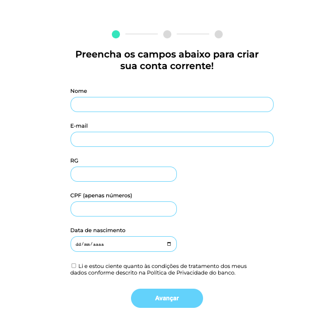
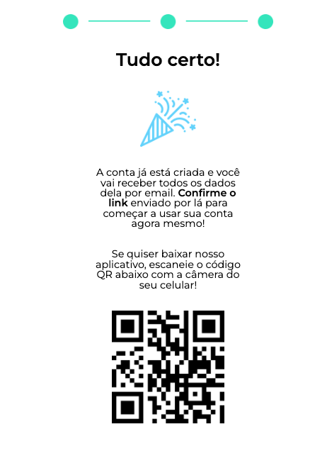
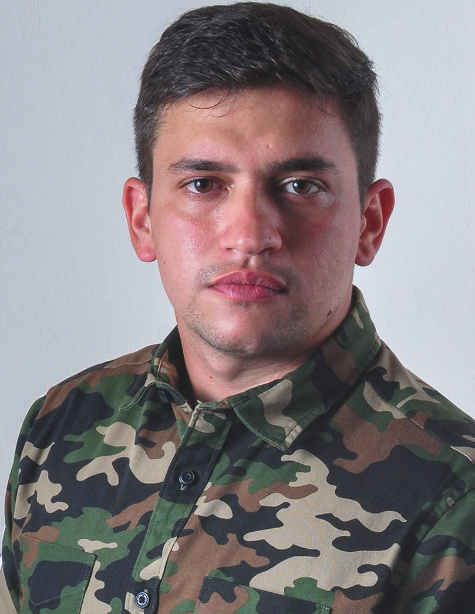

# 💻 #Validando Formulário

[🚀 Acesse aqui]()

## 💻 Exercício

Nesse exercício fiz uma validação de formulário em 3 etapas contento: dados pessoais, captura de foto, e conclusão

## 🛠 Tecnologias

- HTML
- CSS
- Git
- GitHub

<table>
  <tr>
    <td>
     
    </td>
    <td>
      Feito por Gleidson Queiroz.</a> 🙋🏼‍♂️
    </td>
  </tr>
</table>
